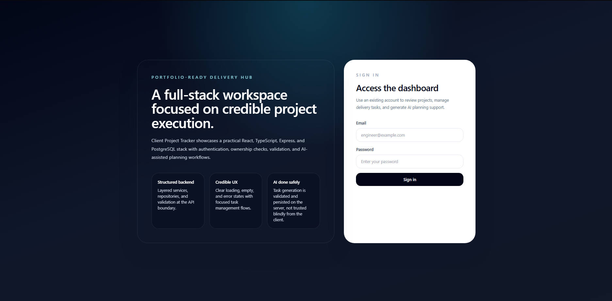
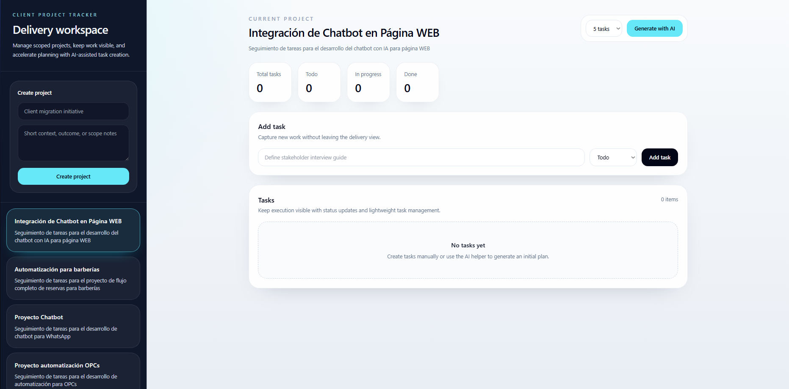
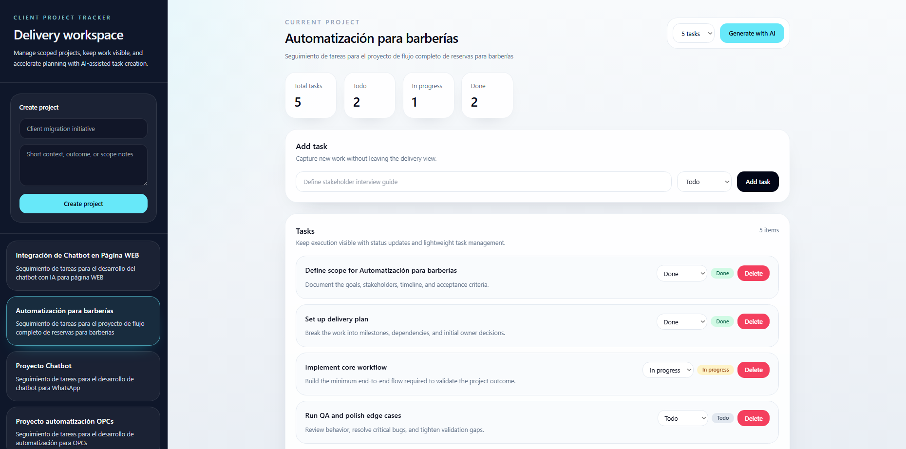

# Client Project Tracker

Client Project Tracker is a full-stack portfolio project for managing client work, tracking delivery tasks, and generating an initial task plan with AI support.

The project is intentionally scoped. It is not trying to look like a multi-tenant enterprise platform. The goal is to show clear engineering judgment in a smaller product:

- a coherent auth story
- strong request validation
- ownership checks on protected resources
- explicit backend layering
- a frontend that feels like a real workflow instead of a CRUD tutorial
- an AI integration that works locally without requiring a paid API

## What It Covers

- email/password authentication with JWT
- project CRUD scoped to the authenticated user
- task CRUD scoped through project ownership
- AI-assisted task generation on the server
- deterministic mock AI mode for local evaluation
- centralized error handling and structured logging

## Preview

### Login Flow



### Dashboard



### AI Task Generation




## Stack

### Backend

- Node.js
- Express 5
- TypeScript
- PostgreSQL with `pg`
- Zod
- JWT
- bcrypt
- pino / pino-http

### Frontend

- React 19
- Vite
- TypeScript
- Tailwind CSS
- Axios
- React Router

## Architecture

### Backend

- `src/routes`: route registration and middleware composition
- `src/controllers`: HTTP-only concerns
- `src/services`: business rules and ownership enforcement
- `src/repositories`: SQL access
- `src/schemas`: request validation
- `src/ai`: provider interface plus `mock` and `openai` adapters
- `src/middlewares`: auth, not-found, and centralized error handling

### Frontend

- `frontend/src/pages`: route-level screens
- `frontend/src/components`: dashboard and shared UI pieces
- `frontend/src/hooks`: dashboard state orchestration
- `frontend/src/api`: Axios client and typed API calls
- `frontend/src/types`: frontend domain contracts
- `frontend/src/utils`: auth token and API error helpers

## Auth And Authorization

The auth story is intentionally simple:

- `POST /auth/register` creates an account
- `POST /auth/login` returns a JWT session
- protected routes require `Authorization: Bearer <token>`
- projects and tasks are always resolved through the authenticated owner

There is no public `/users` management surface. That was removed on purpose to keep the domain consistent and avoid authorization ambiguity.

## AI Integration

The project supports two AI modes behind a shared provider interface:

- `mock`: default local/demo mode, no external API required
- `openai`: real provider mode enabled through environment configuration

This is intentional. Portfolio reviewers should be able to run the project without creating an account for a paid AI service.

### Why Mock Mode Exists

- local setup works out of the box
- reviewers can evaluate the AI flow without external credentials
- the backend architecture still demonstrates provider selection, validation, error handling, and persistence discipline

### How Provider Selection Works

- `AI_PROVIDER=mock` uses deterministic local task generation
- `AI_PROVIDER=openai` uses the real provider and requires `AI_API_KEY`

OpenAI requests are handled with:

- explicit provider separation
- output validation before persistence
- timeout handling
- normalized upstream error responses
- transactional task creation after generation

## API Summary

### Public routes

- `GET /health`
- `POST /auth/register`
- `POST /auth/login`

### Protected routes

- `GET /projects`
- `GET /projects/:id`
- `POST /projects`
- `PATCH /projects/:id`
- `DELETE /projects/:id`
- `GET /tasks?projectId=<uuid>`
- `GET /tasks/:id`
- `POST /tasks`
- `PATCH /tasks/:id`
- `DELETE /tasks/:id`
- `POST /ai/generate-tasks`
- `POST /ai/generate-and-create-tasks`

## Local Setup

### 1. Install dependencies

```bash
npm install
npm --prefix frontend install
```

### 2. Configure environment variables

```bash
cp .env.example .env
cp frontend/.env.example frontend/.env
```

### 3. Start PostgreSQL

Choose one:

- run `sql/init.sql` manually against your database
- run `docker compose up -d`

The included Docker setup exposes PostgreSQL on `localhost:5433`.

### 4. Start the backend

```bash
npm run dev
```

### 5. Start the frontend

```bash
cd frontend
npm run dev
```

The frontend expects the API at `http://localhost:3000` by default.

### 6. Create a user

The frontend currently ships with a login screen only, so create an account once through the API:

```bash
curl -X POST http://localhost:3000/auth/register \
  -H "Content-Type: application/json" \
  -d "{\"email\":\"engineer@example.com\",\"password\":\"supersecret123\",\"name\":\"Portfolio User\"}"
```

After that, sign in through the UI.

## Environment Variables

### Backend

- `NODE_ENV`
- `PORT`
- `DATABASE_URL`
- `JWT_SECRET`
- `JWT_EXPIRES_IN`
- `BCRYPT_SALT_ROUNDS`
- `AI_PROVIDER`
- `AI_API_BASE_URL`
- `AI_MODEL`
- `AI_API_KEY`
- `AI_REQUEST_TIMEOUT_MS`
- `CORS_ORIGIN`

### Frontend

- `VITE_API_URL`

## Quality Checks

```bash
npm run check
```

That command runs:

- backend typecheck
- backend tests
- backend build
- frontend lint
- frontend production build

## Testing Scope

The project intentionally keeps tests small and targeted. Current tests focus on:

- auth service behavior
- ownership enforcement in task flows
- schema-driven validation failures
- AI mock/provider-backed persistence flow

## Tradeoffs

- The project uses direct SQL with small repositories instead of an ORM to keep ownership logic and queries explicit.
- AI mock mode is prioritized over provider breadth because this repo is meant to be runnable without paid dependencies.
- The frontend is intentionally narrow in scope. It focuses on the main workflow instead of covering every possible admin path.

## Repo Notes

- `dist/` is generated output and should not be treated as source.
- `.env` files are excluded from Git.
- The repo may be run entirely in mock AI mode for evaluation.
